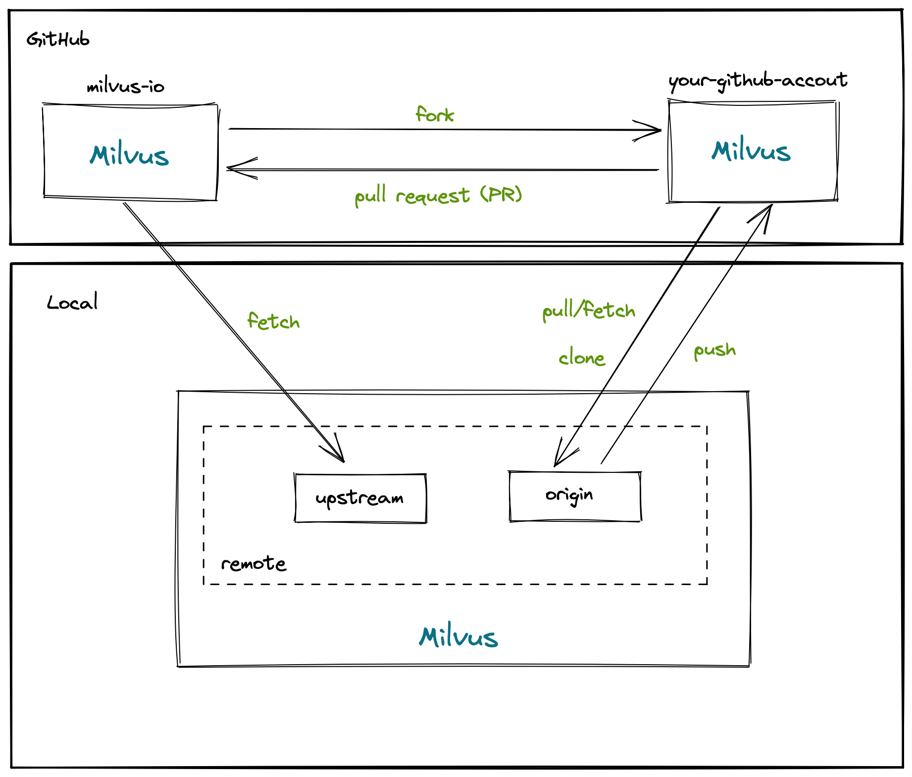
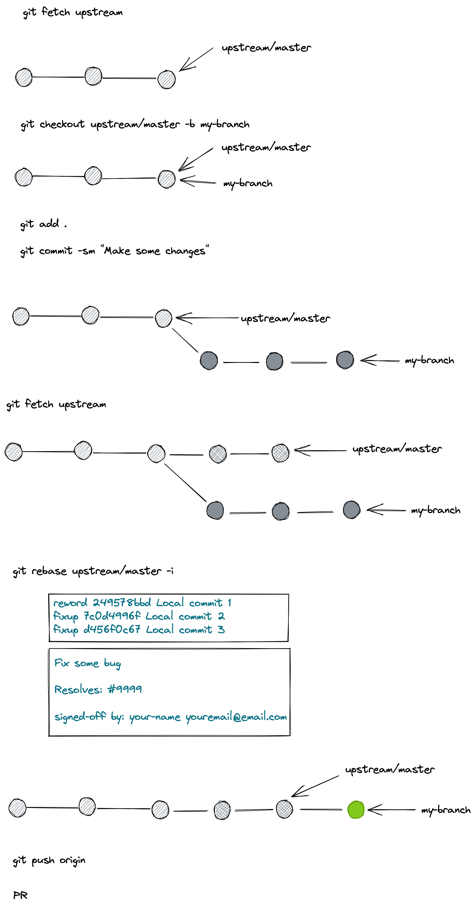

# Hacktoberfest 2021 office hour

为了保证每个 PR 里的代码质量，Milvus 仓库对每个 PR 设有很多检查。说到这里，可能会有人被这么多繁杂的检查劝退贡献代码。

先别着急退缩，Milvus 针对不同类型的 PR 设有不同类型的检查，不涉及代码的 PR 合并规则非常简单，而涉及代码的合并规则会复杂一些。

> 注：下文针对 Milvus 仓库的贡献指南同样适用于 PyMilvus 仓库，下文就不再重复提及 PyMilvus 仓库。

## GitHub Workflow

我们推荐您使用 Git 命令行工具来完成代码贡献流程。这个贡献流程适合所有人，适用于任何类型的贡献。这个流程假定您已经了解了 Git 的基本操作。

### Fork - pull 



### Local Git



## PR 合并条件

- DCO 检查通过
- 代码质量测试，单元测试，集成测试全部通过，如果满足会获得 `ci-passed` 标签
  - 如果您的 PR 没有代码修改，那么请在 commit message 标题开头加上 `[skip-ci]` ，这样可以避免跑这些测试
- Reviewer review PR，如果满足会获得 `lgtm` 标签
- Approver approve PR，如果满足会获得 `approve` 标签

## Commit Messages 最佳实践

[commit messages reference](https://chris.beams.io/posts/git-commit/)

```
Summarize changes in around 50 characters or less

More detailed explanatory text, if necessary. Wrap it to about 72
characters or so. In some contexts, the first line is treated as the
subject of the commit and the rest of the text as the body. The
blank line separating the summary from the body is critical (unless
you omit the body entirely); various tools like `log`, `shortlog`
and `rebase` can get confused if you run the two together.

Explain the problem that this commit is solving. Focus on why you
are making this change as opposed to how (the code explains that).
Are there side effects or other unintuitive consequences of this
change? Here's the place to explain them.

Further paragraphs come after blank lines.

 - Bullet points are okay, too

 - Typically a hyphen or asterisk is used for the bullet, preceded
   by a single space, with blank lines in between, but conventions
   vary here

If you use an issue tracker, put references to them at the bottom,
like this:

Resolves: #123
See also: #456, #789

Signed-off-by: Your-Github-Name <yourname@email.com>
```


## Milvus 和 PyMilvus Hacktoberfest 项目介绍

[Milvus Hacktoberfest](https://github.com/milvus-io/milvus/issues?q=is%3Aopen+is%3Aissue+label%3AHacktoberfest)

[PyMilvus Hacktoberfest](https://github.com/milvus-io/pymilvus/issues?q=is%3Aopen+is%3Aissue+label%3AHacktoberfest)

[PyMilvus Pick an issue and become a contributor！](https://github.com/milvus-io/pymilvus/issues/685)

