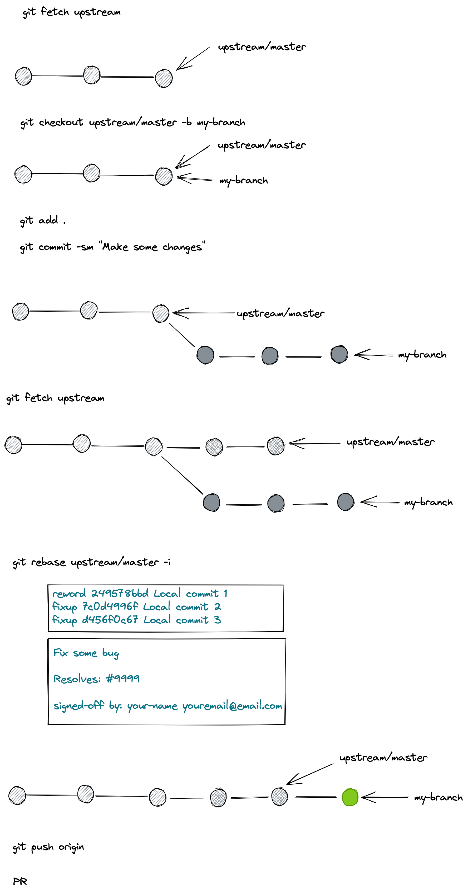

# Hacktoberfest 2021 office hour

为了保证每个 PR 里的代码质量，Milvus 仓库对每个 PR 设有很多检查。说到这里，可能会有人被这么多繁杂的检查劝退贡献代码。

先别着急退缩，Milvus 针对不同类型的 PR 设有不同类型的检查，不涉及代码的 PR 合并规则非常简单，而涉及代码的合并规则会复杂一些。

> 注：下文针对 Milvus 仓库的贡献指南同样适用于 PyMilvus 仓库，下文就不再重复提及 PyMilvus 仓库。

## 纯网页贡献指南（不推荐）

这个贡献流程适合从来没有用过 Git 命令行工具的人。

这份贡献指南有这样两个前提：1. 您已经拥有了 Github 账号。2.您想要对 Milvus 和 PyMilvus 非代码部分的内容进行修改。

1. 请先 fork [Milvus 仓库](https://github.com/milvus-io/milvus)

2. 请在 Github 页面上点击到您想要修改的文件页面，并点击页面右上角的铅笔图案来开启在线修改。在这个在线修改页面上做如下操作：

   1. 修改您之前发现的问题（比如一个错别字）

   2. 填写页面最下方的 `Propose changes` 部分，这部分的内容会成为您这个修改的 commit message。**注意，一旦提交，网页上就无法再更改 commit message，所以您在填写这部分内容时要额外小心。**

      - 请写一个有意义的标题，并且将 `[skip-ci]` 放在标题的最前面，比如

        ```
        [skip-ci]Fix typo in README.md
        ```

      - 请写一段有意义的内容段落。对于简单的文档修改，您只需要在这里面签署 DCO即可。签署 DCO 简而言之就是把您的名字和邮箱署在 commit message 里面。

        > 再次提醒，commit message 无论是标题还是内容，一旦提交就无法在 GitHub 网页上修改。如果您在这一步签署 DCO 失败，或者在之后的 PR 中遇到任何和 commit message 相关的问题，那么只能在本地使用 git 命令行工具来修正。这样你就得去参考更为复杂也更为常用的 [GitHub workflow](#github-workflow) 了。
        >
        > DCO 里邮箱左右的 `<>` 尖括号是必须的，请务必加上。DCO 里面的名字和邮箱都必须是您 GitHub 的账号名和邮箱。

        ```markdown
        Signed-off-by: your-github-name <your-github-email>
        ```

      - 确认填写的内容无误之后，请点击绿色的按钮 `Propose changes`。再次提醒，此步骤之后您这个 commit message 无法在 GitHub 线上修改。

3. 请在出现的页面中确认您即将要提 PR 想要合入的仓库和分支是否为 `milvus-io/milvus` 和 `master`，确认无误后点击  `Create pull request` 绿色按钮进入 PR 创建页面。

4. PR 创建页面中， GitHub 会拷贝您之前填写的 commit message 标题和内容作为这个 PR 的标题和内容。您需要在 PR 的内容里添加这样一行：

   ```markdown
   /kind improvement
   ```

   我们的 @sre-ci-robot 看到这一行文字会给您的 PR 自动打上 `kind/improvement` 的标签，方便我们在下一次发布时拉取 Release Notes。

5. 最后，您可以点击 `Create pull request` 来创建这个 PR。

6. 接下来，就请等待 Milvus 仓库的维护者来跟您交流啦！

   commit message 以 `[skip-ci]` 开头，以及不涉及 `internal/` 里文件修改的 PR 不会运行 Milvus 的单测 GitHub action，不会运行代码质量检查的 GitHub action，也不会运行 Milvus 的集成测试。

   简而言之，在修改内容正确的情况下，简单的文档修改 PR 合并条件非常宽松。Milvus 社区只会对您 PR 的 commit message 有所要求，一个要求是签署正确的 DCO，另一个就是要求 commit message 格式正确。在提交 commit message 之前可以参见下文的 [Commit Message 最佳实践](#commit-messages-最佳实践) 来校对您的 commit message。

当您按照新手贡献指南的指示给 Milvus 贡献代码，中途却遇到问题时，您都需要从头开始您的贡献流程。因为 GitHub 页面上不能更改已经提交的 commit，无论是 commit message 还是您修改的内容都无法再被修改。因此，虽然新手贡献流程免去了您对 Git 命令行工具的繁杂操作，但是需要您打起精神不犯任何错误，任何错误在线上都是不可逆的。

## GitHub Workflow

我们推荐您使用 Git 命令行工具来完成代码贡献流程。这个贡献流程适合所有人，适用于任何类型的贡献。这个流程假定您已经了解了 Git 的基本操作。

### Fork - pull 


### Local Git



## PR 合并条件

- DCO 检查通过
- 代码质量测试，单元测试，集成测试全部通过，如果满足会获得 `ci-passed` 标签
  - 如果您的 PR 没有代码修改，那么请在 commit message 标题开头加上 `[skip-ci]` ，这样可以避免跑这些测试
- Reviewer review PR，如果满足会获得 `lgtm` 标签
- Approver approve PR，如果满足会获得 `approve` 标签

## Commit Messages 最佳实践

[commit messages reference](https://chris.beams.io/posts/git-commit/)

```
Summarize changes in around 50 characters or less

More detailed explanatory text, if necessary. Wrap it to about 72
characters or so. In some contexts, the first line is treated as the
subject of the commit and the rest of the text as the body. The
blank line separating the summary from the body is critical (unless
you omit the body entirely); various tools like `log`, `shortlog`
and `rebase` can get confused if you run the two together.

Explain the problem that this commit is solving. Focus on why you
are making this change as opposed to how (the code explains that).
Are there side effects or other unintuitive consequences of this
change? Here's the place to explain them.

Further paragraphs come after blank lines.

 - Bullet points are okay, too

 - Typically a hyphen or asterisk is used for the bullet, preceded
   by a single space, with blank lines in between, but conventions
   vary here

If you use an issue tracker, put references to them at the bottom,
like this:

Resolves: #123
See also: #456, #789

Signed-off-by: Your-Github-Name <yourname@email.com>
```


## Milvus 和 PyMilvus Hacktoberfest 项目介绍

[Milvus Hacktoberfest](https://github.com/milvus-io/milvus/issues?q=is%3Aopen+is%3Aissue+label%3AHacktoberfest)

[PyMilvus Hacktoberfest](https://github.com/milvus-io/pymilvus/issues?q=is%3Aopen+is%3Aissue+label%3AHacktoberfest)

[PyMilvus Pick an issue and become a contributor！](https://github.com/milvus-io/pymilvus/issues/685)

