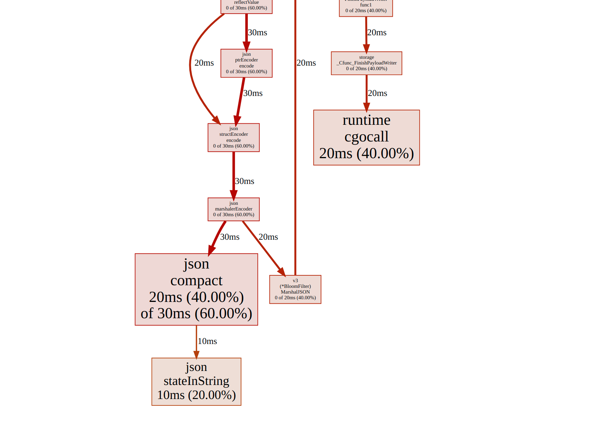
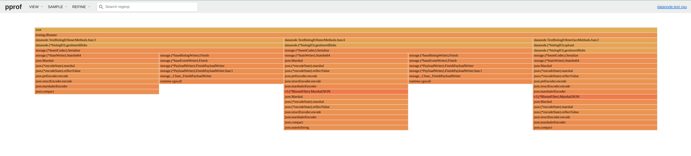

# How to debug Milvus

- Logs
- Inspect meta
- Profiling Golang/CPP

## Three different types of profiling
### 1. CPU profiling
### 2. Memory profiling
### 3. Tracing
### 4. How to choose?

## Tools
### 1. go pprof

#### 1. How to generate profiling files?

**For go unit tests, use gotest's standard `-cpuprofile` and `-memprofile` flags**

See [Testing flags](https://pkg.go.dev/cmd/go#hdr-Testing_flags)

For example, this will run unit tests matchs `BinlogIO` in package `datanode`
and generate `datanode.test`, `cpu.prof` and `mem.prof`
```shell
milvus/internal/datanode$ go test -cpuprofile cpu.prof -memprofile mem.prof -run BinlogIO
```
**For a standalone program, use `runtime/pprof`**

To add equivalent profilling support to a standalone program, add the following codes into your main function[]
```golang
// ...

// ref@[3] https://pkg.go.dev/runtime/pprof#hdr-Profiling_a_Go_program
var cpuprofile = flag.String("cpuprofile", "", "write cpu profile to `file`")
var memprofile = flag.String("memprofile", "", "write memory profile to `file`")

func main() {
    flag.Parse()
    if *cpuprofile != "" {
        f, err := os.Create(*cpuprofile)
        if err != nil {
            log.Fatal("could not create CPU profile: ", err)
        }
        defer f.Close() // error handling omitted for example
        if err := pprof.StartCPUProfile(f); err != nil {
            log.Fatal("could not start CPU profile: ", err)
        }
        defer pprof.StopCPUProfile()
    }

    // ... rest of the program ...

    if *memprofile != "" {
        f, err := os.Create(*memprofile)
        if err != nil {
            log.Fatal("could not create memory profile: ", err)
        }
        defer f.Close() // error handling omitted for example
        runtime.GC() // get up-to-date statistics
        if err := pprof.WriteHeapProfile(f); err != nil {
            log.Fatal("could not write memory profile: ", err)
        }
    }
}
```

**For a long-running server, use `net/http/pprof`**

#### 2. How to use the generated profiling files?

**Visulization:**

This command uses `datanode.test` (binary) and `cpu.prof` (profiling file) to exam cpu profilings, and provides web
interface and automaticaly opening a browser at `localhost:9999`

```
milvus/internal/datanode$ go tool pprof -http localhost:9999 datanode.test cpu.prof
```

You are able to check everything on the browser, especially graphics, just click around





**Command line:**

This line will establish an interactive pprof shell
```
milvus/internal/datanode$ go tool pprof datanode.test cpu.prof

File: datanode.test
Build ID: 3f1cb676163b24145d3945e5169154a6ce31813d
Type: cpu
Time: Dec 17, 2021 at 4:07pm (CST)
Duration: 301.42ms, Total samples = 50ms (16.59%)
Entering interactive mode (type "help" for commands, "o" for options)
(pprof) 
```

Check top10 cum:
```
(pprof) top10 -cum
Showing nodes accounting for 20ms, 40.00% of 50ms total
Showing top 10 nodes out of 23
      flat  flat%   sum%        cum   cum%
         0     0%     0%       50ms   100%  github.com/milvus-io/milvus/internal/datanode.(*binlogIO).genInsertBlobs
         0     0%     0%       50ms   100%  github.com/milvus-io/milvus/internal/storage.(*InsertCodec).Serialize
         0     0%     0%       50ms   100%  testing.tRunner
         0     0%     0%       30ms 60.00%  encoding/json.(*encodeState).marshal
         0     0%     0%       30ms 60.00%  encoding/json.(*encodeState).reflectValue
         0     0%     0%       30ms 60.00%  encoding/json.Marshal
      20ms 40.00% 40.00%       30ms 60.00%  encoding/json.compact
         0     0% 40.00%       30ms 60.00%  encoding/json.marshalerEncoder
         0     0% 40.00%       30ms 60.00%  encoding/json.ptrEncoder.encode
         0     0% 40.00%       30ms 60.00%  encoding/json.structEncoder.encode
```


### 2. go trace
### 2. dlv
### 3. gdb

---

**References:**

[1] Doc of go testing flags. *https://pkg.go.dev/cmd/go#hdr-Testing_flags* 

[2] Doc of `net/http/pprof`. *https://pkg.go.dev/net/http/pprof* `go doc net/http/pprof` 

[3] Doc of `runtime/pprof`. *https://pkg.go.dev/runtime*. `go doc runtime/pprof` 

[4] Full useage of tool `pprof`. *https://github.com/google/pprof/blob/master/doc/README.md* 

[5] Go blog: Profiling Go Programs. *https://go.dev/blog/pprof*

[6] Doc of `cmd/trace`. *https://pkg.go.dev/cmd/trace*

[7] Doc of `cmd/pprof`. *https://pkg.go.dev/cmd/pprof*

[8] Doc of `runtime/trace`. *https://pkg.go.dev/runtime/trace*

[9] GopherCon 2017: An Introduction to go tool trace. *https://about.sourcegraph.com/go/an-introduction-to-go-tool-trace-rhys-hiltner/*

[10] GopherCon 2019: Two Go programs, three different profiling techniques, in 50 miniutes. [link](https://about.sourcegraph.com/go/gophercon-2019-two-go-programs-three-different-profiling-techniques-in-50-minutes/), [Youtube](https://www.youtube.com/watch?v=nok0aYiGiYA&list=PL2ntRZ1ySWBdDyspRTNBIKES1Y-P__59_&index=9)
